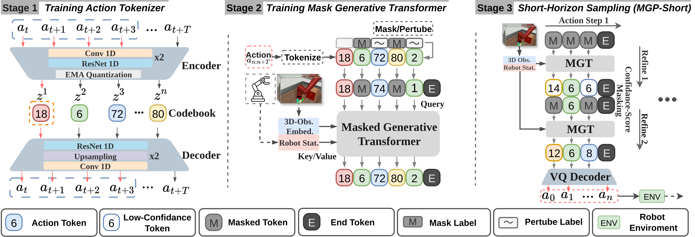
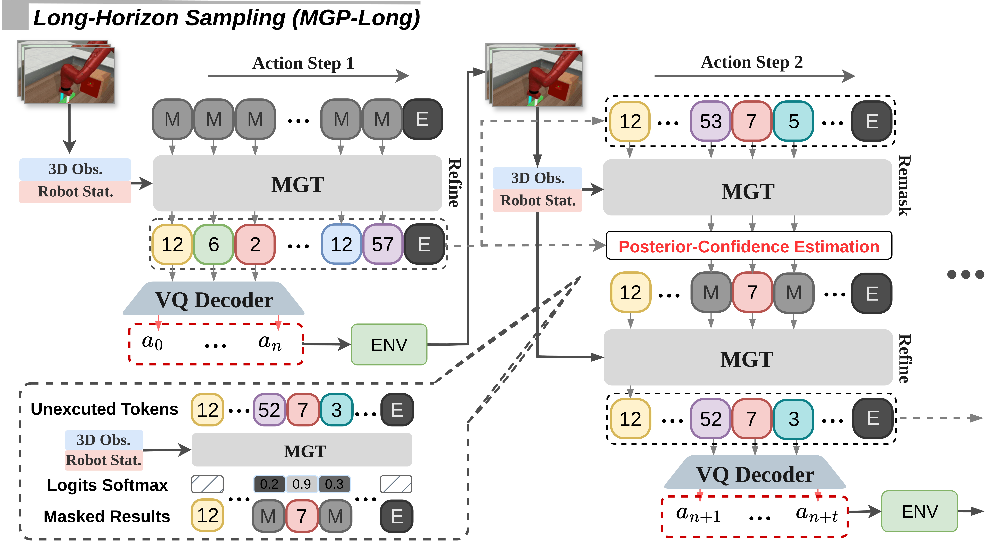

# 🦾 Masked Generative Policy For Robotic Control

Official implementation of **“Masked Generative Policy for Robotic Control”**, under review at **ICLR 2026**.  
**Masked Generative Policy (MGP)** is a **fast, accurate, adaptive, and globally-coherent generative policy** for visuomotor imitation learning — combining the efficiency of autoregressive transformers and the flexibility of diffusion models.

[[📄 Relevant Code](https://anonymous.4open.science/r/masked_generative_policy-8BC6/MGP)] • [[🎥 Videos & Results](https://anonymous.4open.science/r/masked_generative_policy-8BC6/Video)]

---

## 🌟 Overview

<p align="center">
  
</p>

[//]: # (![]&#40;docs/MGP_Teaser_Final.pdf&#41;)
**MGP** is the ***first*** masked generative framework for robot imitation learning which achieves **low inference latency** and **high task success rates** while supporting **rapid plan edits** during execution.

***Two*** novel sampling paradigms are proposed:

- **MGP-Short** – **Real-time** closed-loop control for **Markovian tasks**.
- **MGP-Long** – delivers **globally coherent long-horizon predictions** with **dynamic adaptation**, **resilient execution under partial observability**, and **efficient, flexible replanning** for **non-Markovian, long-duration, dynamic, and missing-observation environments**.

---

## 🧠 Method Summary

<p align="center">    </p> <p align="center">   <em> Left: Training Stage 1 - Action Tokenizer and Middle: Training Stage 2 - Masked Generative Transformer and Right: Short-horizon sampling (MGP-Short). </p> <p align="center">    </p> <p align="center">   Long-horizon sampling (MGP-Long) through Adaptive Token Refinement (ATR). </p>

**MGP-Long** integrates a novel **Adaptive Token Refinement (ATR)** strategy that predicts a global trajectory and iteratively refines the **yet-to-be-executed** action tokens as **new observations** arrive, while keeping executed actions fixed. During refinement, our ***Posterior-Confidence Estimation*** selectively masks and corrects low-likelihood unexecuted tokens, continuously updating confidence scores to guide targeted edits using current observations and historic states.

---

## 📊 Standard Benchmarks Evaluation

Evaluated on **Meta-World**, **LIBERO-90**, and **LIBERO-Long** benchmarks (**150+** manipulation tasks).

| Benchmark              | Avg. Success ↑ | Speed Gain ↓               | Notes                             |
| ---------------------- | :------------- | -------------------------- | --------------------------------- |
| Meta-World (50 tasks)  | **0.637**      | **49× faster** than DP3    | **SOTA** on short-horizon control |
| LIBERO-90 (90 tasks)   | **0.889**      | **3.4× faster** than QueST | **SOTA** on Multitask performance |
| LIBERO-Long (10 tasks) | **0.820**      | **3× faster** than QueST   | **SOTA** on Long-horizon tasks    |

---

## 🖼️ Robustness To Missing Observations

MGP (MGP-Long) demonstrates **strong robustness** to missing visual inputs, even when the probability of missing observations rises to **70%**. MGP-Long increases the average success rate by **21%** over the **full-horizon** model and by **32%** over the **short-horizon** model.

------

## 🔄 Dynamic Environment Results

<p align="center">         <br>       </p> <p align="center">  MGP (MGP-Long) delivers the best performance on five dynamic environments: <em>Basketball</em>, <em>Pick Place Wall–Wall </em>, <em>Pick Place Wall–Target</em>, <em>Push</em>, and <em>Push Wall</em>. </p>

------

## 🧩Non-Markovian Environment Results

### Examples of Expert Demonstration

<p align="center">       </p> <p align="center">   <em>Button Press Color Change Task.</em> Visualization of two expert demonstrations used for training. Videos are played at {N}× real-time speed. </p>

<p align="center">       </p> <p align="center">   <em>Button Press On/Off Task.</em> Visualization of two expert demonstrations used for training. Videos are played at {N}× real-time speed. </p>

### Visulization Results

<p align="center">       </p> <p align="center">   <em>Button Press Color Change Task.</em> Qualitative results of MGP-Long (Left) and short-horizon methods (Right). </p>

<p align="center">       </p> <p align="center">   <em>Button Press On/Off Task.</em> Qualitative results of MGP-Long (Left) and short-horizon methods (Right). </p>

### MGP-Long is the only method that succeeds on both non-Markovian button tasks, achieving a 100% success rate.

------

## 🧩 Core Code Structure Overview

The repository is organized into modular components to support **training**, **evaluation**, and **visualization** of the Masked Generative Policy framework.

```
MGP/
├── core/
│   ├── env_runner/        
│   │		├── env_runner_MGP.py # Rollout/interaction loop
│   ├── model/   
│   │		├── mgt/              # Architecture of Training phrases of MGP
│   │		│		├── act_vq.py
│   │		│		├── pose_encoding.py
│   │		│		├── quantization.py
│   │		│		├── resnet.py
│   │		│		├── transformer.py
│   │		├── mgt_utils/        # Configs, losses, and shared model utilities
│   │		│		├── config.py
│   │		│		├── config_long.py
│   │		│		├── losses.py
│   │		│		├── utils_model.py
│   │		├── policy/           # MGP Policy wrapper (MGP-Short and MGP-Long)
│   │		│   ├── mgt.py
├── train_vq.py           # Train the stage one: action tokenizer 
├── train_trans.py        # Train the stage two: masked generative policy and short-horizon sampling: MGP-Short
├── train_trans_long.py   # Train the stage two: masked generative policy and long-horizon sampling: MGP-Long
```

> 🔒 **Note:** **The complete training and inference code will be released upon paper acceptance.**

------

## 🧭 Acknowledgements

- **3D Diffusion Policy (DP3)** — • [GitHub](https://github.com/YanjieZe/3D-Diffusion-Policy)
- **QueST: Self-Supervised Skill Abstractions for Learning Continuous Control** — • [Project page](https://quest-model.github.io/)

------

## 🔍 License

Released under the **MIT License**.
 See [LICENSE](LICENSE) for details.